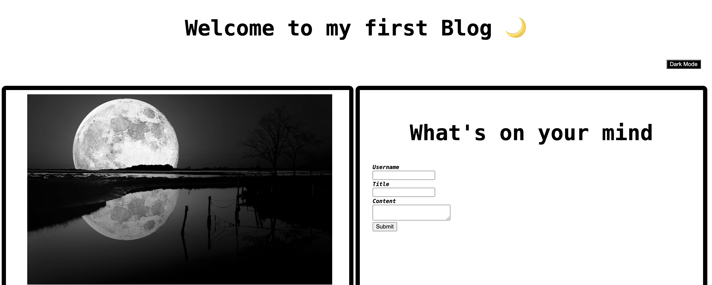

# personal_blog

## Description 

This is a personal blog created to test my coding skills in creating a dark mode, connecting pages and local storage. 

- For training purposes as well as job application
- Applying concepts learned in class
- Maximazing learnability

## Example 

## Links

For access to deployed website [Click Here](https://parryprogramming.github.io/personal_blog/)